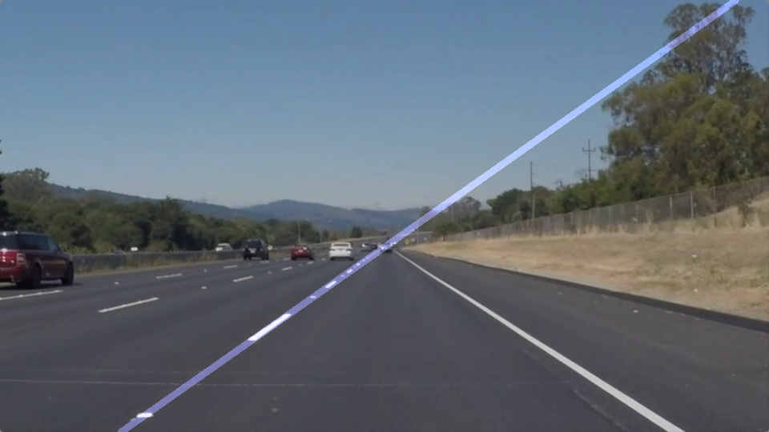

# Finding Lane Lines on the Road - Assignment Entry

This repository contains my solution for the Finding Lane Lines assignment.

![An example output][cover_image]

### Building the environment

- Download and install the [CarND Term1 Starter Kit](https://github.com/udacity/CarND-Term1-Starter-Kit)
- Clone this repository

### Executing the pipeline

- Switch to _carnd-term1_ environment and start Jupyter:  
  `$ source activate carnd-term1`  
  `$ cd ~/CarND-LaneLines-P1`  
  `$ jupyter notebook`  
- Navigate to `http://localhost:8888/`, open the _P1_ notebook and click on `Kernel / Restart & Run all`
- The pipeline should execute on the test images, the input videos and on the challenge video

## Algorithm description

The pipeline analyses a color input image and returns a color image with the identified lane lines drawn onto it.

### Process

From the input image two edge image is created:  
`edges_from_shape = greyscale -> gauss-blur -> canny`  
`edges_from_color = select white pixels U select yellow pixels -> gauss-blur -> canny`  
The final edge image is the combination of the two:  
`edges = edges_from_shape U edges_from_color`  

![Process of finding edges][edges]
_Edges from shape information, edges from color segmentation and the final edge image_

A Hough-line detection is performed on the region where the road is most likely to appear. The output segments are categorized into left and right groups based on their angle:  
`left_segments = segment in segments : -90° < segment.angle < -20°`  
`right_segments = segment in segments : 90° > segment.angle > 20°`  

These segments are converted into `XTheta` representations, which defines lines by their:
- X-intercept: the point where the line intersects with the x-axis
- Theta: the signed angle between the line and the x-axis
- Weight (optional): the weight associated with the line

The left and the right lanes are the average lines of the lines in the respective sets. The lines are weighted by the length of their originating segments.  
`left_lane_line = XTheta(avg_x_intercept, avg_angle) of left_lines`  
`right_lane_line = XTheta(avg_x_intercept, avg_angle) of right_lines`  

For still images the final lane is this average line:  

  
_The entire left lane drawn onto an input image_

For videos a fixed size queue is defined that contains the formerly identified lines. This queue is intended to improve precision and reduce jitter in the result. If the lane line cannot be identified on a frame of the video, the missing entry is filled with the average value from the queue. 

For videos, the final lanes are:  
`averaged_left_lane_line = XTheta(avg_x_intercept, avg_angle) of left_lane_lines in queue`  
`averaged_right_lane_line = XTheta(avg_x_intercept, avg_angle) of right_lane_lines in queue`  

![Snapshots from the output video yellow.mp4][yellow_snapshots]
_The pipeline executing on an input video_

![Snapshots from the output video extra.mp4][challenge_snapshots]
_The pipeline executing on the challenge video_

## Reflection
Below are the most important weaknesses of the pipeline with possible ways of enhancement.

### Thresholding
Probably this is the biggest weakness. The algorithms used in the pipeline requires plenty of thresholds, but right now these are sort of "trained" on the input datasets. It causes them to perform well on an input similar to the example input - e.g. daylight on a highway with little traffic -, but it is likely to fail under different conditions - e.g. at night in the city. 

The most important thresholds to consider are the canny thresholds, and the color segmentation thresholds. 

A possible way to improve their performance would be to use some histogram equalization algorithm. This might result in better performance - even with fixed thresholds - under varying conditions. Another possibility might be to define presets, and try to choose the best one based on some analysis of the current light and weather conditions.

### Lane representation

Right now the lanes are approximated as lines. This works fine until the lanes are close to a straight line, but this method will not work on a road with steep curves. The lanes should be either represented as chain of lines, or even better, as curves - for example with a point on the bottom of the image and a tangent vector. A variant of the Hough-transformation might be used to identify such curves.

### Object detection

Right now a good view of the road is expected, but under some conditions part of the lanes might be hidden by other cars. Also, painted signs on the road could appear, whose edges along with the edges from cars will all be calculated into the lane localization. It is easy to imagine that a zebra crossing will cause the mislocalization of the lane. Cars, traffic signs and other objects should be removed from the camera image to improve stability and performance.

--
Made for the Self-Driving Car NanoDegree Program at Udacity

[//]: # (Image References)

[cover_image]: ./documentation/cover_image.png
[edges]: ./documentation/edge_progress.png
[left_lane]: ./documentation/full_left_lane_drawn.png
[yellow_snapshots]: ./documentation/snapshots_from_yellow.png
[challenge_snapshots]: ./documentation/snapshots_from_extra.png

